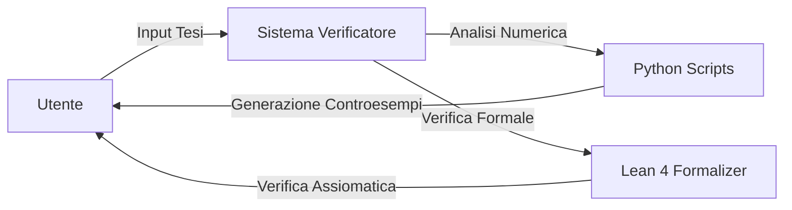
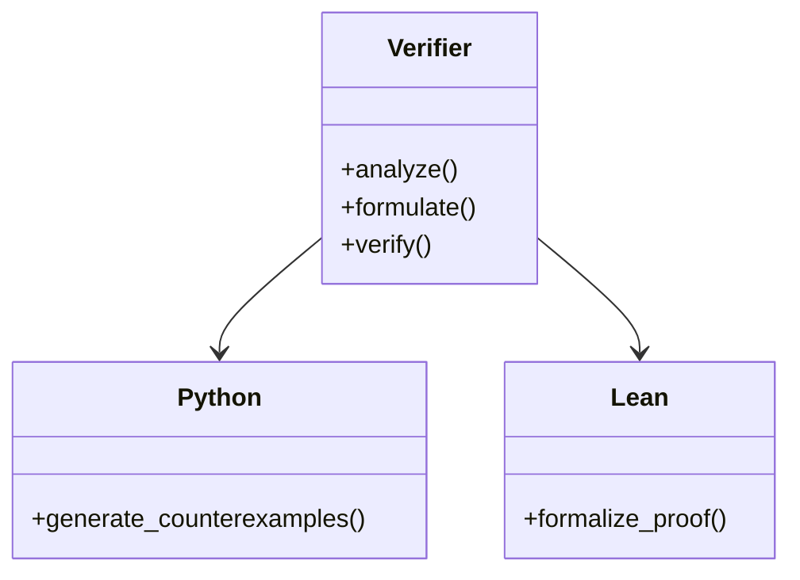
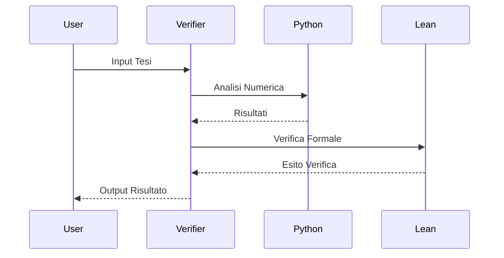

## Verificatore di Teoremi del Millennio (Python + Lean 4)

Questo progetto implementa un sistema ibrido di verifica formale per i problemi del Millennium Prize, utilizzando:
- **Python** per l'analisi numerica e la generazione di controesempi.
- **Lean 4** per la verifica assiomatica (formalizzazione).
- **GitHub Actions** per la CI/CD e l'esecuzione automatica dei test.
- **Mermaid** per la generazione di diagrammi.

## Specifiche Tecniche
- **Python**: 3.10
- **Lean 4**: 4.10.0
- **Architettura**: Client-Server
- **Repository**: GitHub
- **Licenza**: MIT

## Setup
```bash
python -m venv .venv
source .venv/bin/activate
pip install -r requirements.txt
```

## Architettura



## Diagramma UML



## Diagramma di Sequenza




## Licenza

Licenza MIT

## Contribution

Contributi ben accetti. Si prega di aprire una issue o una pull request.

## Disclaimer

Questo progetto è solo a scopo didattico e non è affiliato al Clay Mathematics Institute.


